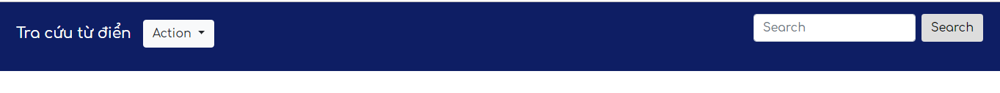
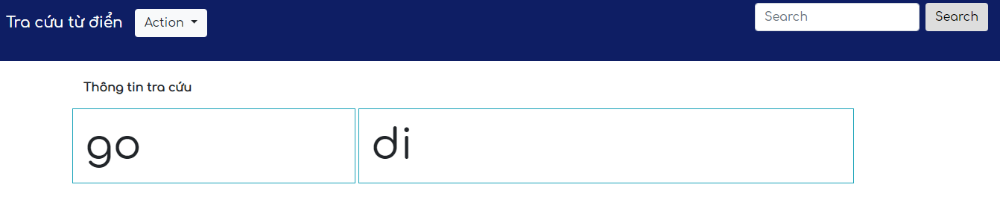
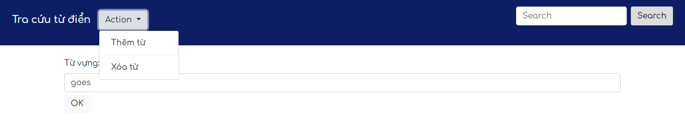
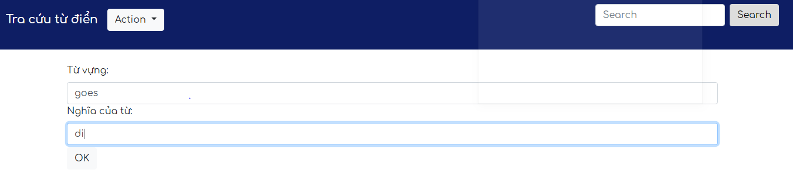

Lastest update: 11/7/2019 11:32 PM 

Web dictionary: support windows,ios,adroid,ubuntu && Mac

Disadvantage : accent errors in Vietnamese 

Esay Install :
  First step: Install Python3.x.x
      
  Second :  Install django-admin (reference https://pypi.org/project/django-admin/ )
        
          pip install django-admin 
          Note : pip ( pip in python3.x.x) 
  Run app :
          
          run commend in terminal
          cd folder build_dictionary/dic
          Run commend with terminal : python manage.py runserver ( python == 3.x.x)
  Front-end : bootstrap, html, css, javascript.
  
  The app includes features: add new word, delete word in dictionary, search word, save struct Trie in file pickle
  
  
  choose action
  
  
  search word
  

  delete word 
  

  add new word
  
